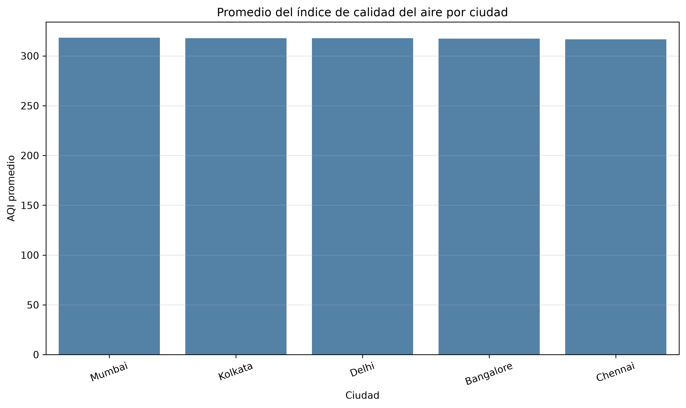
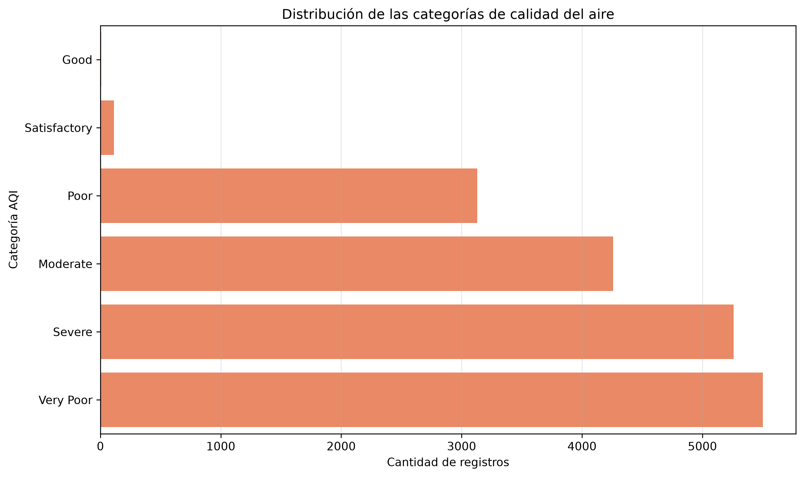
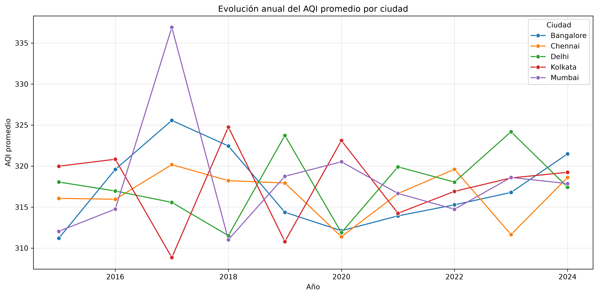
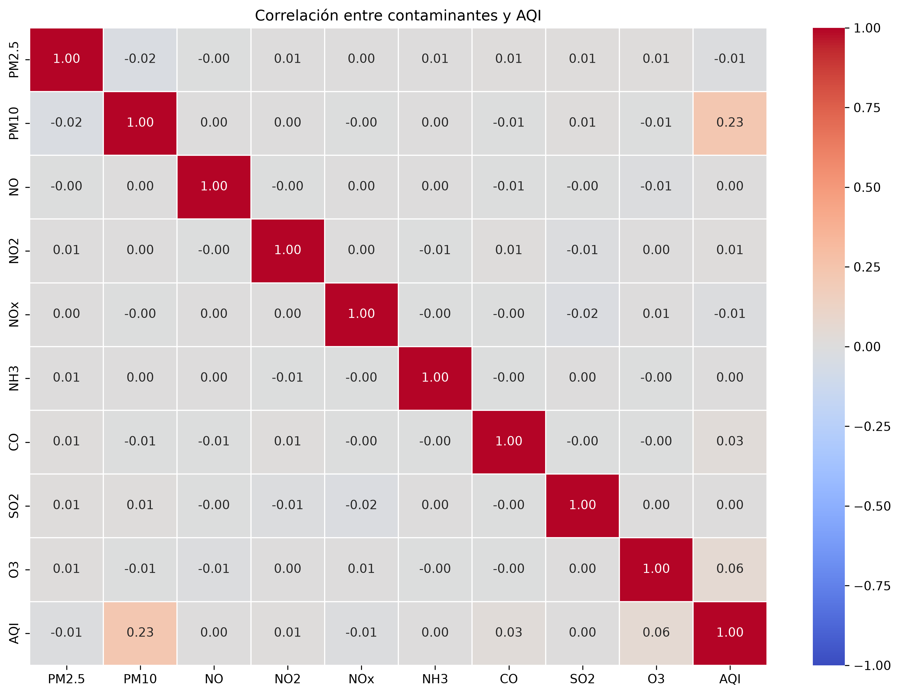
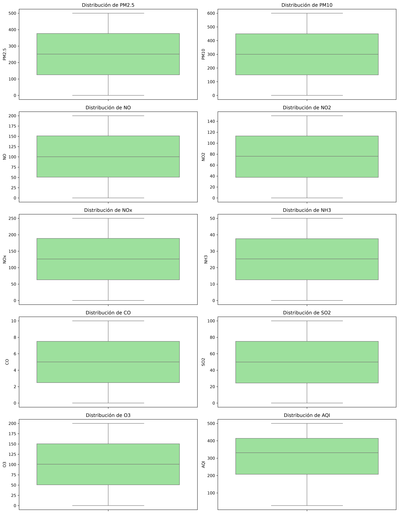

# Informe técnico

## ETL y análisis de la calidad del aire en India

**Integrantes:** Samuel Flores y Santiago Becerra
**Curso:** ETL
**Fecha:** 14/09/2026

---

## Resumen

En este trabajo construimos un proceso ETL para organizar y analizar datos sobre la calidad del aire en cinco ciudades de India entre los años 2015 y 2024.

Primero tomamos un archivo CSV descargado desde Kaggle. Después revisamos la información, verificamos que no tuviera datos faltantes ni registros repetidos y transformamos la columna de fecha para obtener el año, el mes, el día, el trimestre y el día de la semana.

Luego guardamos los datos en una base de datos SQLite y construimos un modelo dimensional tipo estrella. Finalmente, hicimos consultas SQL y varias gráficas para analizar el AQI, los contaminantes y las categorías de calidad del aire.

Los resultados muestran que la mayoría de los registros pertenece a categorías desfavorables, especialmente `Very Poor` y `Severe`.

---

## 1. Introducción

La contaminación del aire es un problema que puede afectar la salud de las personas y el funcionamiento de las ciudades. Por eso es importante contar con datos organizados que permitan conocer cómo se comportan los contaminantes y cuáles son los niveles generales de calidad del aire.

Para este proyecto escogimos un dataset de cinco ciudades de India. A partir de estos datos construimos un proceso ETL completo: extracción, transformación y carga.

El trabajo se realizó utilizando Python, Pandas, SQLite, SQL, Jupyter Notebook y GitHub Codespaces.

---

## 2. Objetivos

### 2.1 Objetivo general

Construir un proceso ETL para almacenar y analizar información de calidad del aire de cinco ciudades de India entre 2015 y 2024.

### 2.2 Objetivos específicos

* Extraer la información desde un archivo CSV.
* Revisar la estructura y calidad de los datos.
* Identificar valores nulos, duplicados y fechas inválidas.
* Transformar la columna de fecha y crear nuevas variables temporales.
* Guardar la información en una base de datos SQLite.
* Crear un modelo dimensional tipo estrella.
* Hacer consultas SQL sobre la base de datos.
* Crear gráficas a partir de los datos almacenados en SQLite.
* Interpretar los resultados obtenidos.

---

## 3. Relación con los Objetivos de Desarrollo Sostenible

### ODS 3: Salud y bienestar

La contaminación del aire puede afectar la salud de las personas. Analizar el AQI permite identificar cuándo la calidad del aire es buena, moderada o desfavorable.

### ODS 11: Ciudades y comunidades sostenibles

Las ciudades necesitan información ambiental para tomar mejores decisiones. Comparar la calidad del aire entre diferentes ciudades permite reconocer problemas y posibles necesidades de monitoreo.

---

## 4. Fuente y descripción de los datos

Los datos se obtuvieron del siguiente dataset de Kaggle:

[AQI Air Quality Data India 2015–2024](https://www.kaggle.com/datasets/sathvikisikella/cleaned-air-quality-india)

El archivo utilizado fue `Air_quality_data.csv`.

El dataset contiene:

* 18.265 registros.
* 13 columnas originales.
* Cinco ciudades: Delhi, Mumbai, Chennai, Kolkata y Bangalore.
* Fechas desde el 1 de enero de 2015 hasta el 31 de diciembre de 2024.
* Diez variables numéricas relacionadas con contaminantes y calidad del aire.
* Una columna con la ciudad.
* Una columna con la categoría del AQI.

---

## 5. Variables del dataset

| Variable     | Significado                                    |
| ------------ | ---------------------------------------------- |
| `City`       | Ciudad donde se tomó el registro               |
| `Datetime`   | Fecha del registro                             |
| `PM2.5`      | Partículas muy pequeñas suspendidas en el aire |
| `PM10`       | Partículas de polvo y humo                     |
| `NO`         | Monóxido de nitrógeno                          |
| `NO2`        | Dióxido de nitrógeno                           |
| `NOx`        | Grupo de óxidos de nitrógeno                   |
| `NH3`        | Amoníaco                                       |
| `CO`         | Monóxido de carbono                            |
| `SO2`        | Dióxido de azufre                              |
| `O3`         | Ozono                                          |
| `AQI`        | Índice general de calidad del aire             |
| `AQI_Bucket` | Categoría del nivel de calidad del aire        |

Las variables PM10, O3, SO2 y CO representan diferentes tipos de contaminación. El AQI no es un contaminante; es un número que resume la calidad general del aire. Entre mayor sea el AQI, peor es la condición del aire.

---

## 6. Proceso ETL

### 6.1 Extracción

En la primera fase leímos el archivo `Air_quality_data.csv` utilizando Pandas. La información se cargó en un DataFrame para poder revisarla y procesarla.

### 6.2 Transformación

En la segunda fase convertimos la columna `Datetime` a un formato de fecha correcto. También creamos las siguientes columnas:

* `Year`
* `Month`
* `Day`
* `Quarter`
* `Day_of_Week`

Además, verificamos que no existieran fechas inválidas.

### 6.3 Carga

En la tercera fase guardamos los datos transformados en la base de datos SQLite `air_quality.db`.

Inicialmente se creó la tabla `air_quality`, que contiene la información completa después de la transformación.

---

## 7. Validación de los datos

La revisión inicial produjo los siguientes resultados:

* 18.265 filas.
* 13 columnas originales.
* 18 columnas después de las transformaciones.
* Cero valores nulos.
* Cero filas duplicadas.
* Cero fechas inválidas.
* Fecha mínima: 2015-01-01.
* Fecha máxima: 2024-12-31.

También aplicamos el método IQR para revisar valores extremos en las variables numéricas. No se identificaron outliers, por lo que no fue necesario eliminar ni modificar registros.

---

## 8. Modelo dimensional

Para organizar mejor la información construimos un modelo estrella. Este modelo tiene una tabla central de hechos y tres tablas de dimensiones.

### `dim_city`

Guarda las ciudades y el identificador de cada una.

### `dim_date`

Guarda la fecha y sus partes: año, mes, día, trimestre y día de la semana.

### `dim_aqi`

Guarda las categorías de calidad del aire.

### `fact_air_quality`

Es la tabla principal. Contiene las mediciones de PM2.5, PM10, NO, NO2, NOx, NH3, CO, SO2, O3 y AQI.

La tabla de hechos se relaciona con las dimensiones mediante:

* `city_id`
* `date_id`
* `aqi_id`

El modelo quedó conformado por:

* 5 ciudades.
* 3.653 fechas.
* 6 categorías de AQI.
* 18.265 mediciones de calidad del aire.

---

## 9. Estadísticas descriptivas

Los promedios principales fueron los siguientes:

| Variable | Promedio |
| -------- | -------: |
| PM2.5    |   250,60 |
| PM10     |   299,44 |
| NO       |   100,48 |
| NO2      |    75,42 |
| NOx      |   125,96 |
| NH3      |    25,07 |
| CO       |     5,00 |
| SO2      |    49,84 |
| O3       |   100,41 |
| AQI      |   317,51 |

El promedio del AQI fue de 317,51 y la mediana fue de 331,6. Esto muestra que una gran parte de los registros se encuentra en niveles altos del índice de calidad del aire.

---

## 10. Registros por ciudad

Cada ciudad tiene exactamente 3.653 registros:

| Ciudad    | Cantidad |
| --------- | -------: |
| Bangalore |    3.653 |
| Chennai   |    3.653 |
| Delhi     |    3.653 |
| Kolkata   |    3.653 |
| Mumbai    |    3.653 |

Los promedios de AQI de las ciudades son muy parecidos. Por eso, en este conjunto de datos no se observan diferencias muy grandes entre las ciudades cuando se calcula el promedio general.

---

## 11. Categorías de calidad del aire

| Categoría    | Cantidad |
| ------------ | -------: |
| Very Poor    |    5.501 |
| Severe       |    5.258 |
| Moderate     |    4.258 |
| Poor         |    3.129 |
| Satisfactory |      113 |
| Good         |        6 |

Las categorías más frecuentes son `Very Poor` y `Severe`. En cambio, la categoría `Good` aparece solamente seis veces. Esto indica que la mayoría de los registros representa condiciones poco favorables de calidad del aire.

---

## 12. Visualizaciones

### 12.1 Promedio del AQI por ciudad

Las cinco ciudades presentan promedios de AQI parecidos. Mumbai aparece ligeramente por encima y Kolkata ligeramente por debajo, pero la diferencia entre ellas es pequeña.

*Figura 1. Promedio del índice de calidad del aire por ciudad.*

### 12.2 Distribución de las categorías AQI

La gráfica confirma que las categorías `Very Poor` y `Severe` concentran la mayor cantidad de registros.

*Figura 2. Cantidad de registros por categoría de calidad del aire.*

### 12.3 Evolución anual del AQI

El AQI cambia de un año a otro y cada ciudad presenta un comportamiento diferente. No se observa una tendencia igual para todas las ciudades.

*Figura 3. Evolución anual del AQI promedio por ciudad.*

### 12.4 Correlación entre contaminantes y AQI

La correlación más alta con el AQI corresponde a PM10, con un valor aproximado de 0,23. Sin embargo, esta sigue siendo una relación débil.

Las correlaciones aproximadas de otras variables con el AQI fueron:

* O3: 0,06.
* CO: 0,03.
* SO2: 0,001.

Una correlación indica si dos variables tienden a cambiar juntas, pero no demuestra que una sea la causa de la otra.

*Figura 4. Correlación entre las variables de contaminación y el AQI.*

### 12.5 Diagramas de caja

Los diagramas de caja permiten observar la distribución y dispersión de las variables. No se observan puntos extremos importantes, lo cual coincide con el resultado obtenido mediante el método IQR.

*Figura 5. Diagramas de caja de las variables numéricas.*

---

## 13. Tecnologías utilizadas

Para realizar el proyecto utilizamos:

* Python.
* Pandas.
* NumPy.
* Matplotlib.
* Seaborn.
* SQLite.
* SQL.
* Jupyter Notebook.
* Git.
* GitHub Codespaces.

---

## 14. Estructura del proyecto

El proyecto quedó organizado de la siguiente manera:

* `data/raw/`: contiene el archivo original.
* `data/processed/`: contiene los datos procesados, si se generan.
* `database/`: contiene la base de datos SQLite.
* `notebooks/`: contiene los notebooks de exploración y análisis.
* `src/`: contiene los scripts del proceso ETL.
* `sql/`: contiene el esquema del modelo dimensional.
* `report/`: contiene el informe y las figuras.

Los archivos principales son:

* `src/etl.py`
* `src/cargar_modelo_dimensional.py`
* `sql/schema.sql`
* `notebooks/01_exploracion_inicial.ipynb`
* `notebooks/02_analisis_desde_bd.ipynb`
* `database/air_quality.db`

---

## 15. Cómo ejecutar el proyecto

Primero se instalan las dependencias con:

`pip install -r requirements.txt`

Después se ejecuta el proceso ETL con:

`python src/etl.py`

Luego se carga el modelo dimensional con:

`python src/cargar_modelo_dimensional.py`

Finalmente se ejecutan los notebooks desde Jupyter o desde GitHub Codespaces.

---

## 16. Limitaciones

* El archivo CSV no especifica las unidades de medida de todas las variables.
* El dataset proviene de Kaggle y ya presenta una estructura limpia.
* La correlación realizada es descriptiva y no demuestra causalidad.
* El dataset solo contiene cinco ciudades, por lo que los resultados no representan a toda India.
* No se incluyeron variables meteorológicas, económicas o demográficas que también podrían influir en la calidad del aire.

---

## 17. Conclusiones

En este trabajo construimos un proceso ETL completo que organiza y analiza datos de calidad del aire en India.

Primero validamos 18.265 registros y comprobamos que no había valores nulos, duplicados ni fechas inválidas. Después transformamos las fechas, agregamos nuevas variables y cargamos la información en SQLite.

También construimos un modelo estrella con las dimensiones de ciudad, fecha y categoría del AQI, junto con la tabla de hechos que contiene las mediciones de los contaminantes.

El análisis mostró que las categorías `Very Poor` y `Severe` son las más frecuentes. Las ciudades presentan promedios de AQI similares, aunque sus valores cambian de manera diferente a lo largo de los años.

La relación más alta con el AQI fue la de PM10, pero fue débil. Por esta razón, las correlaciones se interpretaron como asociaciones descriptivas y no como relaciones de causa y efecto.

---

## Referencias

* Kaggle. *AQI Air Quality Data India 2015–2024*.
  https://www.kaggle.com/datasets/sathvikisikella/cleaned-air-quality-india

* Material de clase sobre extracción, transformación, carga, detección de valores extremos y modelos dimensionales.
